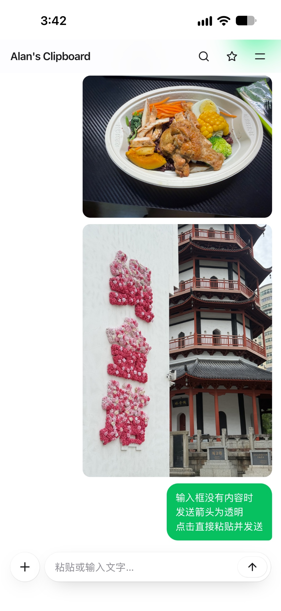
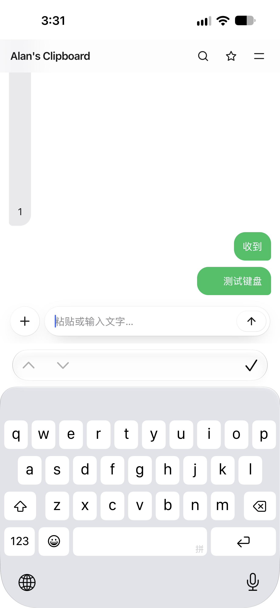
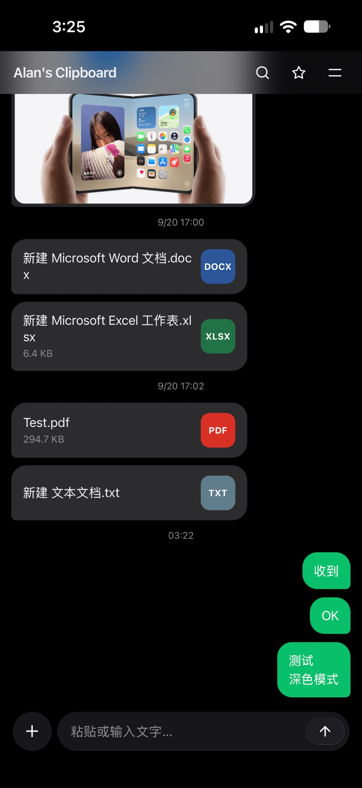
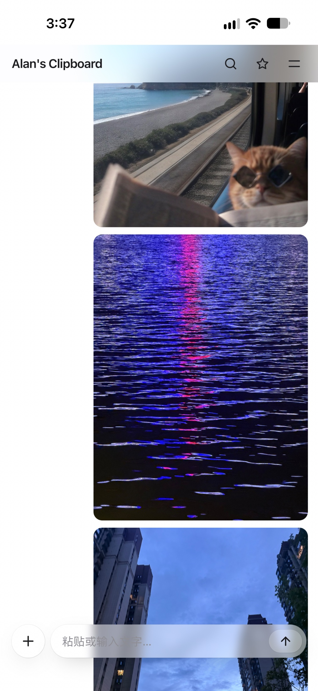
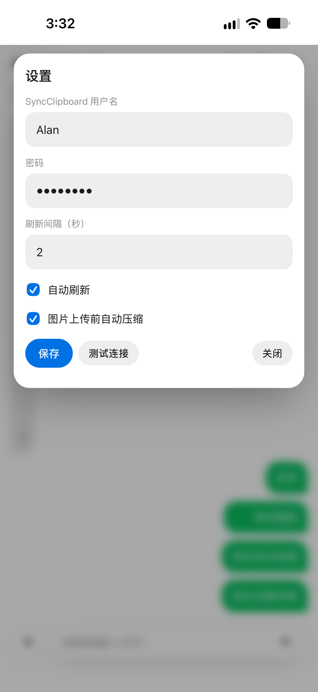

# clipweb

给 [SyncClipboard](https://github.com/jerick/SyncClipboard) 套的浏览器界面 —— 手机打开网页就能和电脑互传剪贴板，不依赖 iOS 快捷指令。

## 功能

- **剪贴板同步**：手机上打开网页，电脑上复制的内容几秒后自动出现在手机里；手机发出去的内容同样同步到电脑。
- **文件传输**：支持图片、文档（pdf/word/excel/ics 等）双向传输，文件气泡显示文件名、大小和彩色扩展名图标。
- **聊天式界面**：左灰气泡 = 电脑来的，右绿气泡 = 自己发的（像聊天气泡一样看谁发的），历史无限回看。
- **移动端深度适配**：iOS 毛玻璃观感、键盘弹层、"加到主屏幕"独立窗口、原生长按菜单（图片可存储到照片）。
- **零依赖**：无框架、无构建、无 CDN，改完刷新即生效。

## 界面

**主界面（浅色 · 磨砂顶栏 + 聊天气泡 + 玻璃底栏）**



<details>
<summary>键盘弹起 · 输入交互</summary>


</details>

<details>
<summary>深色模式 · 文件卡片</summary>


</details>

<details>
<summary>滚动时的毛玻璃效果</summary>


</details>

<details>
<summary>设置面板</summary>


</details>

## 目录结构

```
├── html/
│   ├── index.html         # 页面本体：全部 UI + CSS
│   └── app.js             # 全部逻辑：轮询、认证、渲染、缓存、贴底、菜单
├── nginx.conf             # 部署关键：静态页 + API 反代，WebDAV 兼容
├── deploy/
│   └── config.example.json  # SyncClipboard 服务端配置示例（脱敏）
├── docs/
│   └── img/                 # README 界面截图
└── Dockerfile             # clipweb 容器构建（nginx:alpine）
```

## 部署

### 1. SyncClipboard 服务端

宿主机上跑 [SyncClipboard](https://github.com/jerick/SyncClipboard) 服务端，监听 `127.0.0.1:5033`（配置参考 `deploy/config.example.json`，改账号密码）。

### 2. clipweb 容器

```bash
docker build -t clipweb .
docker run -d --name clipweb --net=host clipweb
```

clipweb 用 host 网络，监听 `5034`。网页和 API 同源，浏览器访问 `http://<nas-ip>:5034/` 即可。

### 3. 反代规则（可选，HTTPS）

宿主机上再套一层 nginx/DSM 反代，把 HTTPS 指到 `127.0.0.1:5034`。Windows 客户端走 WebDAV 协议，nginx.conf 里已处理 `PROPFIND /` 的兼容（见文件内注释）。

## License

MIT
